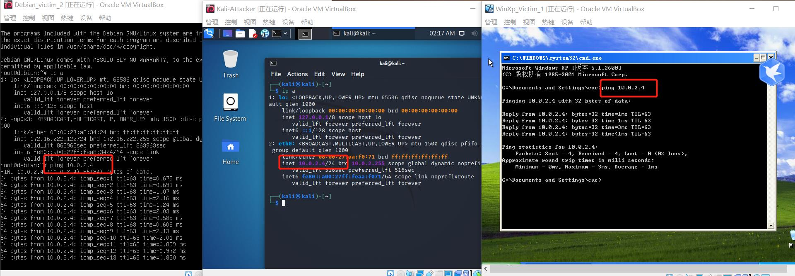

# 网络安全——实验一


## 基于 VirtualBox 的网络攻防基础环境搭建


### 实验目的

1. 掌握 VirtualBox 虚拟机的安装与使用；
2. 掌握 VirtualBox 的虚拟网络类型和按需配置；
3. 掌握 VirtualBox 的虚拟硬盘多重加载；

------


### 实验环境

以下是本次实验需要使用的网络节点说明和主要软件举例：

- VirtualBox 虚拟机
- 攻击者主机（Attacker）：Kali Rolling (2021.2) x64
- 网关（Gateway, GW）：Debian 10
- 靶机（Victim）：Debian10 / xp-sp3-base / Kali-Linux-2021.2

------


### 实验要求

- 虚拟硬盘配置成多重加载

- 搭建满足如下拓扑图所示的虚拟机网络拓扑

  

> 根据实验宿主机的性能条件，可以适度精简靶机数量

- 完成以下网络连通性测试：

1. 靶机可以直接访问攻击者主机
2. 攻击者主机无法直接访问靶机
3. 网关可以直接访问攻击者主机和靶机
4. 靶机的所有对外上下行流量必须经过网关
5. 所有节点均可以访问互联网

------


### 实验步骤

1. **虚拟机实现多重加载**

   通过老师的链接下载系统镜像

   在虚拟介质管理器里面选中盘片之后选择多重加载，新建的时候直接选择使用多重加载的镜像文件。

   

   

   

   

2. **安装虚拟机**（按照拓扑图要求创建所有需要的虚拟机）

   

3. **按照实验要求的拓扑图进行网络配置**

   - 网关配置：

     - 配置四块网卡分别为"NAT网络"“Host Only”“内部网络（intnet1）”和“内部网络（intnet2）”：

       | 网卡名称 |   VB中的网络类型   |      IP地址       |
       | :------: | :----------------: | :---------------: |
       |  enp0s3  |      NAT网络       |   10.0.2.15/24    |
       |  enp0s8  |     Host-Only      | 192.168.56.113/24 |
       |  enp0s9  | 内部网络1(intnet1) |  172.16.111.1/24  |
       | enp0s10  | 内部网络2(intnet2) |  172.16.222.1/24  |

       

       

       

       内部网络详细配置：

       

       

       

       Host-Only中DHCP服务器详细配置：

       

       

       

       开启作为网关的虚拟机，查看各个网卡的地址：

       

       

   - 靶机和攻击者主机网络配置

     - 按照实验要求网络拓扑配置WinXp_Victim_1和Kali_Victim_1网络为内部网络“intnet1”

       

       

     - 配置WinXp_Victim_2和Debian_victim_2网络为内部网络“intnet2”

       

       

     - 攻击者主机kali-Attacker为NAT网络

       

     - 开启各个虚拟机并查看网络地址

       

       

       

       

       

       

     - 整理出各个虚拟机对应的IP地址如下：

       | 虚拟机名称      | IP地址                                |
       | --------------- | ------------------------------------- |
       | Kali_Attacker   | 10.0.2.4/24（NATNetwork）             |
       | Kali_Victim_1   | 172.16.111.134/24（内部网络 intnet1） |
       | WinXp_Victim_1  | 172.16.111.125/24（内部网络 intnet1） |
       | WinXp_Victim_2  | 172.16.222.131/24（内部网络 intnet2） |
       | Debian_Victim_2 | 172.16.222.122/24（内部网络 intnet2） |
       | Debian_Gateway  | 10.0.2.15/24 （NATNetwork）           |
       |                 | 192.168.56.113/24 （Host Only）       |
       |                 | 172.16.111.1/24（内部网络 intnet1）   |
       |                 | 172.16.222.1/24（内部网络 intnet2）   |

4. **连通性测试**（需要将winXP系统的防火墙关掉，否则不能ping通）

   - [x] 靶机可以直接访问攻击者主机

     

   - [x] 攻击者主机无法直接访问靶机

     

   - [x] 网关可以直接访问攻击者主机和靶机

     

   - [x] 靶机的所有对外上下行流量必须经过网关

     在网关上安装`tcpdump`，并对**对应网卡**进行监控。在各个节点上访问互联网，观察捕获到了上下行的所有包。

     ```
     apt update && apt install tcpdump
     /usr/sbin/tcpdump -i enp0s9(对应网卡) # etc
     ```

     

     

     

     *要用**对应网卡**进行监测，如上面三幅图所示：第一、二幅图是使用对应的网卡进行监测的，所以可以捕获到包；图三不是使用对应的网卡进行监测的，所以捕获不到包。*

   - [x] 所有节点均可以访问互联网

     

     

****


### 遇到的问题和解决办法

1. 无法配置网卡为"NAT网络"

   

   **解决办法:**

   管理——全局设定——网络——添加新NAT网络——重新设置”NAT“网络即可

   ------

   

   ### 参考链接

   [2021 秋教学日历 - 传媒信安教学 Wiki (gitee.io)](https://c4pr1c3.gitee.io/cuc-wiki/ns/2021/calendar.html)
   
   [第一章课后实验详解](https://www.bilibili.com/video/BV1CL41147vX?p=12)
   
   ------
   
   


