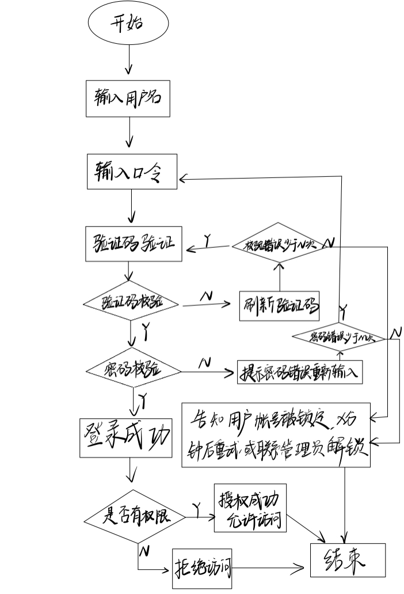
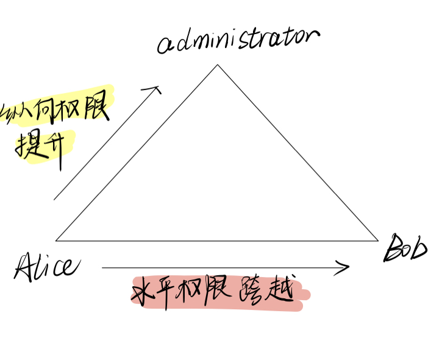
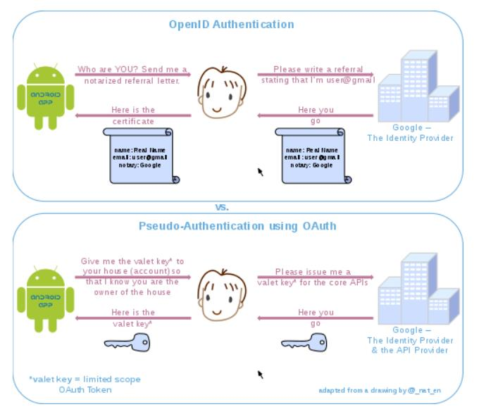

# 网络安全——实验二

## 操作系统的访问控制设计实例研究

* 以 `HarmonyOS` 系统为研究对象
    * 实验环境
        * 操作系统版本：2.0.0
        * 版本号：2.0.0.165(C00E160R2P4patch03) GPU Turbo
        * 硬件设备型号：VOG-AL00
        
    * 当系统处于锁屏状态下接收到新短信时，不解锁情况下
        * 系统是否允许查看短信内容？**不允许**
        * 系统是否允许回复短信？**不允许**
        
    * 当系统**处于锁屏状态下**，使用系统内置（例如 iOS 的 Siri ）或第三方的语音助手可以完成以下哪些操作？
    
        * 访问通讯录：**不能**访问通讯录，需要先解锁手机。
    * 拨打电话：**可以**拨打电话。
        * 访问相册：**不能**访问相册，需要先解锁手机。
        * 查看短信收件箱：**不能**查看收件箱，需要先解锁手机。
        
        *第三方语音助手需要录入声音的人唤醒，其他人无法唤醒。（华为`HarmonyOS`的语音助手唤醒口令为”小艺小艺“。）*
    
    * 如果你的手机支持指纹识别解锁手机，请实验并分析指纹识别相比较于简单密码、复杂密码、图形解锁、人脸识别解锁、声纹解锁等解锁方式的安全性、便利性差异。

| 【相比于指纹识别】 |    简单密码    |      复杂密码      |                           图形解锁                           |                       人脸识别解锁                       |    声纹解锁    |
| :----------------: | :------------: | :----------------: | :----------------------------------------------------------: | :------------------------------------------------------: | :------------: |
|       安全性       |  指纹识别更强  | 复杂密码安全性更高 | 主要看图案的复杂程度（复杂的操作单手难以完成，简单的又不太安全。） |             人脸识别更安全（指纹容易被盗取）             | 声纹解锁更安全 |
|       便利性       | 指纹识别更便利 |   指纹识别更便利   |              主要看图形解锁设置的图案的复杂程度              | 指纹识别更便利（人脸识别解锁跟角度、光线等因素都有关系） | 指纹识别更便利 |

思考题：

- 以上设计实现方式属于我们课堂上讲过的哪种强制访问控制模型？Lattice/BLP？Biba？***属于Lattice/BLP模型，允许上写下读。***
- 系统或第三方应用程序是否提供了上述功能的访问控制规则修改？如果修改默认配置，是提高了安全性还是降低了安全性？***是，如果用户修改不当，安全性就会降低。***

---

## 课后题：

### 1.  生物特征身份认证方式有哪些？优缺点分析？应用场景举例。

1. 指纹识别：
   - 应用场景：指纹识别技术是目前较为成熟且价格便宜的生物特征识别技术。目前来说指纹识别的技术应用非常广泛，我们不仅在门禁、考勤系统中可以看到指纹识别技术的身影，市场上有了更多指纹识别的应用：如笔记本电脑、手机、汽车、银行支付都可应用指纹识别的技术
   - 优点：
     - 指纹是人体独一无二的特征，每个人的指纹都是唯一的，所以能够用来进行身份认证。
     - 每个人的指纹都是相当固定的，很难发生变化。
     - 易于获取指纹样本、易于开发识别系统、实用性强。
     - 扫描指纹的速度很快，使用非常方便。
   - 缺点
     - 双手长期手工作业的人们便会为指纹识别而烦恼，他们的手指若有丝毫破损或干湿环境里、沾有异物则指纹识别功能要失效了。
     - 用户留下的指纹痕迹存在被用来复制指纹的可能性。
2. 人脸识别：
   - 应用场景：脸识别技术的应用已经不仅限在商务场所中，它已经以各种智能家居的形式逐步渗透到平常百姓家。
   - 优点：
     - 非接触性：相比较其他生物识别技术而言，人脸识别是非接触的，用户不需要和设备直接接触。
     - 并发性：在实际应用场景中，人脸识别技术可以进行多个人脸的分拣、判断及识别。
     - 非强制性：被识别的人脸图像信息可以主动获取而不被被测个体察觉。
     - 自然性：所谓的自然性是指通过观察比较人脸来区分和确认身份;具有自然性的识别还有语音识别和体形识别。
   - 缺点：
     - 人类脸部存在相似性，不同个体之间的区别不大，所有的人脸的结构都相似，甚至人脸器官的结构外形都很相似。这样的特点对于利用人脸进行定位是有利的，但是对于利用人脸区分人类个体是不利的。在加上化妆的掩盖及双胞胎的天然相似性更增加了识别的难度。
     - 人脸存在易变性，人脸的外形很不稳定，人可以通过脸部的变化产生很多表情，而在不同观察角度，人脸的视觉图像也相差很大。
3. 虹膜识别：
   - 应用场景：安防设备（如门禁等），以及有高度保密需求的场所。
   - 优点：
     - 相对于其他生物识别技术而言，虹膜识别误识率和拒真率已经达到了零几率的识别水平。
     - 虹膜识别属于非接触式的识别，识别方便高效。
     - 虹膜是每个人特有的，具有不可复制的特性，安全等级来说是目前较高的。
   - 缺点：
     - 虹膜识别的应用价格也因其技术难度成正比，设备造价高，无法大范围推广。
     - 很难将图像获取设备的尺寸小型化。
     - 镜头可能产生图像畸变而使可靠性降低。
4. 声纹识别：
   - 应用场景：
     - 在军事情报方面，用于电话领域的监听与追踪。
     - 在监狱管理中，用于亲情通话对象的管控。
     - 在司法取证方面，语音声纹分析识别用于司法鉴定。
     - 在基于电话网络身份识别的应用方面，具体应用就非常广泛了，比如：手机网络支付，手机网络银行等金融业务，社保身份认证，电子政务平台身份认证，呼叫中心来电人员语音辨认，在忘却密码时，自己通过电话将个人帐户密码自助重设，还有电话语音声纹考勤等。
   - 优点：
     - 非常适合远程身份确认，只需要一个麦克风或电话、手机就可以通过网路实现远程登录。
     - 蕴含声纹特征的语音获取方便、自然。
     -  获取语音的成本低廉，使用简单，像麦克风、通讯设备等皆可。
     - 声纹辨认和确认的算法复杂度低。
     - 配合一些其他措施，如通过语音识别进行内容鉴别等，可以提高准确率。
   - 缺点：
     - 同一个人的声音具有易变性，易受身体状况、年龄、情绪等的影响。
     - 不同的麦克风和信道对识别性能有影响。
     - 环境噪音对识别有干扰。
     - 混合说话人的情形下人的声纹特征不易提取。
     - 当人感冒，咽喉发炎等情况声带特性会发生变化而导致识别障碍。

### 2.  “找回口令功能”和“忘记密码”在访问授权机制中的意义？请尝试设计几种安全的“找回口令功能”，详细描述找回口令的用户具体操作过程。

- 意义：

  ​	 “找回口令功能”和“忘记密码”是在真正被授权用户忘记口令时重新获取权限的方式，从而对客体能够正常访问。

- “找回口令功能”方案设计：

  - 找回密码就是让用户重置密码。
  - 重置密码的时候，要给出一个链接，让用户到网页上自己修改密码。
  - 重置密码之前，如果用户提供了错误的邮件地址，不要提示他。
  - 重置密码的时候，识别用户最好依靠邮件地址，而不是用户名。
  - 如果条件允许，重置密码之前，最好请用户回答一些个人问题，或者采用 [2FA 验证](http://www.ruanyifeng.com/blog/2017/11/2fa-tutorial.html)，比如短信验证码。

### 3.  绘制用户使用用户名/口令+图片验证码方式录系统的流程图。考虑认证成功和失败两种场景，考虑授权成功和失败两种场景。

### 4. Windows XP / 7 中的访问控制策略有哪些？访问控制机制有哪些？

自主访问控制 (Discretionary Access Control, DAC)

- 访问令牌 (access token)
- 安全描述符 (security descriptors)
  - 安全标识 (security identifiers, SID)
  - 访问控制列表 (access control list, ACL)
    - 自主访问控制列表(discretionary access control list, DACL)
      - 访问控制项(access control entries, ACE)
    - 系统访问控制列表(system access control list, SACL)

### 5.  用权限三角形模型来理解并描述下 2 种威胁模型：提权、仿冒。

##### 关于提权
- 提权分为：水平特权提升、垂直特权提升
- 提权是指本来没有某项权限的用户，通过一定的方法获得该权限，简而言之，用户以自己的身份获得了本不属于自己的权限
    - 比如用户A本来只能对一个文件进行查看，但是通过提权获得了对文件修改的权利（垂直提权）
    - 或者用户A本来只能查看自己的文件，通过提权可以查看B的文件（水平提权）

##### 关于仿冒
- 仿冒是，用户A以用户B的身份通过了认证，之后行使了B所有的权利

##### 权限三角模型：用户 → 角色（分级） → 权限（对象+操作）
- 提权是`用户→角色→权限`，角色不变，而获取的权限扩大
- 仿冒是`用户→角色`，获取的角色改变，所以能够行使的权限也就因角色的改变而改变了

### 6.  试通过操作系统的访问控制机制来达到预防一种真实病毒的运行目的。

可以通过修改组策略防止蠕虫病毒，例如[熊猫烧香](https://zh.wikipedia.org/wiki/%E7%86%8A%E7%8C%AB%E7%83%A7%E9%A6%99)
- 利用**自动播放**功能
- 添加注册表自启动
- 定时关闭特定程序，如杀毒软件、防火墙
- 删除文件等

1. 检查本机administrator组成员口令，一定要放弃简单口令甚至空口令。
2. 利用组策略，关闭所有驱动器的自动播放功能。
3. 修改文件夹选项，以查看不明文件的真实属性，避免无意双击骗子程序中毒。
4. 时刻保持操作系统获得最新的安全更新，不要随意访问来源不明的网站。
5.  启用Windows防火墙保护本地计算机。

### 7.  什么是 OAuth？

开放授权(OAuth)是一个开放标准/授权协议，而不是身份验证协议。允许用户在第三方应用上访问该用户在某一网站上存储的资源，而无需把用户名和密码提供给第三方应用。

OAuth协议为用户资源的授权提供了一个安全的、开放而又简易的标准。与以往的授权方式不同之处是OAuth的授权不会使第三方触及到用户的帐号信息（如用户名与密码），即第三方无需使用用户的用户名与密码就可以申请获得该用户资源的授权，因此OAuth是“安全的”。同时，任何第三方都可以使用OAuth认证服务，任何服务提供商都可以实现自身的OAuth认证服务，因而OAuth是“开放的”。

### 8.  什么是 OpenID？

一个去中心化的网上身份认证系统。对于支持OpenID的网站，用户不需要记住像用户名和密码这样的传统验证标记。
取而代之的是，他们只需要预先在一个作为OpenID身份提供者（identity provider, IdP）的网站上注册。
OpenID是去中心化的，任何网站都可以使用OpenID来作为用户登录的一种方式，任何网站也都可以作为OpenID身份提供者。
OpenID既解决了问题而又不需要依赖于中心性的网站来确认数字身份。

### 9.  试用本章所学理论分析 OAuth 和 OpenID 的区别与联系。

- OpenID只做了身份认证，没有授予权限，它实现了证明“我就是我”
- OAuth授予第三方应用访问受保护的信息的权限

因此单纯的认证身份没必要用到OAuth，用到第三方网站的外部服务时才需要用OAuth

### 10.  如何使用 OAuth 和 OpenID 相关技术实现单点登录（Single Sign On）？

单点登录 (SSO)

> 一种对于许多相互关连，但是又是各自独立的软件系统，提供访问控制的属性。当拥有这项属性时，当用户登录时，就可以获取所有系统的访问权限，不用对每个单一系统都逐一登录。

##### Microsoft Account

微软账户是一个单点登录微软账户，使微软用户登录微软网站（如Outlook），运行在微软操作系统的设备（如Windows10电脑/平板、WindowsPhone、Xbox），微软应用软件（如Visual Stdio）

1. 当用户第一次登录时，将用户名密码发送给用户服务
2. 验证用户将用户标识OpenId返回到客户端
3. 客户端进行存储
4. 访问子系统,将OpenId发送到子系统
5. 子系统将OpenId转发到验证服务
6. 验证服务将用户认证信息返回给子系统
7. 子系统构建用户验证信息后将授权后的内容返回给客户端

---

## 参考资料

- [OAuth, wikipedia](https://en.wikipedia.org/wiki/OAuth)
- [OpenID, wikipedia](https://en.wikipedia.org/wiki/OpenID)
- [单点登录（SSO）看这一篇就够了](https://developer.aliyun.com/article/636281)
- [浅谈SAML, OAuth, OpenID和SSO, JWT和Session](https://juejin.im/post/5b3eac6df265da0f8815e906)
- [SSO And LDAP Authentication](https://archive.is/20140523114521/http://www.authenticationworld.com/Single-Sign-On-Authentication/SSOandLDAP.html)
- [访问控制技术与Windows访问控制](https://wenku.baidu.com/view/ab8b4e2b453610661ed9f4aa.html)

