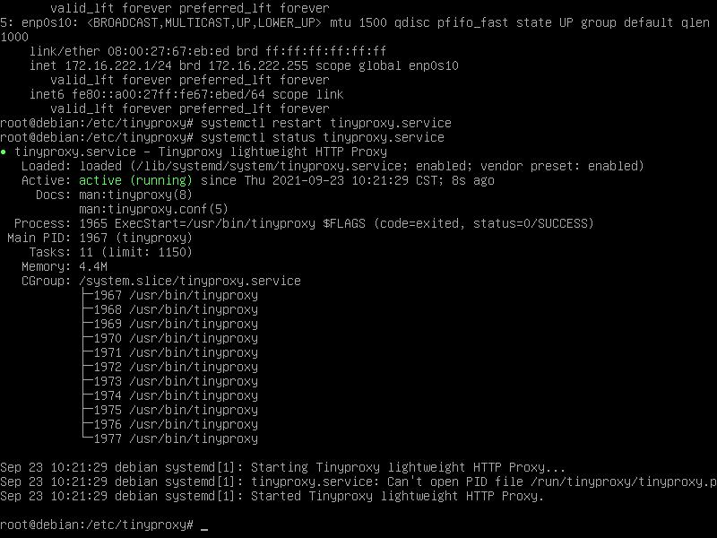
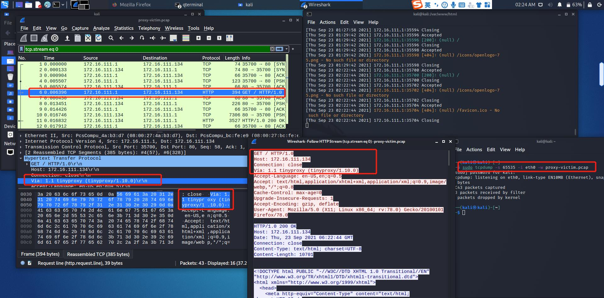

# HTTP正向代理实验


## 实验目的

- Kali-Gateway中安装```tinyproxy```
- 用主机设置浏览器代理指向`tinyproxy`建立的HTTP正向代理
- 在Kali中用wireshark抓包
- 分析抓包过程，理解HTTP正向代理HTTPS流量的特点（kali自带wireshark）

## 实验步骤

1. **准备好实验所需的拓扑结构并验证连通性**


|        | 攻击者 | 网关 | 靶机 |
| :----: | :----: | :--: | :--: |
| 攻击者 |   -    |  √   |  x   |
|  网关  |   √    |  -   |  √   |
|  靶机  |   √    |  √   |  -   |

***Attacker无法直接ping通Victim,设置Gateway作为代理来访问Victim。***

- 攻击者可以ping通网关，不能ping通靶机，可以上网。

  

- 网关可以ping通攻击者，可以ping通靶机，可以上网。

  

- 靶机可以ping通攻击者，可以ping通网关，可以上网。

  

2. **在网关配置tinyproxy**

在网关上下载tinyproxy，并进行配置，之后开启tinyproxy服务

```
apt-get update & apt-get install tinyproxy
# 备份tinyproxy配置文件
cp /etc/tinyproxy/tinyproxy.conf /etc/tinyproxy/tinyproxy.conf.bak
# 编辑tinyproxy配置文件
vim /etc/tinyproxy/tinyproxy.conf
# 开启tinyproxy服务
systemctl start tinyproxy
# 如果后面再次修改了tinyproxy的配置文件，记得需要重启tinyproxy服务
systemctl restart tinyproxy.service
#查看tinyproxy服务状态
systemctl status tinyproxy.service
```




3. **在攻击者主机的浏览器中配置代理服务**

打开firefox，依次点击`Preferences-Advanced-Network-Connection Settings`进入代理设置，填写网关IP及端口号


4. **在靶机开启web服务**

   ```
   <?php
   var_dump($_SERVER);
   ```
   
   ```
   php -S 0.0.0.0:8080
   ```
   
   
   
   
   
   
   
5. **使用tinyproxy访问靶机**

   **在攻击者(Attacker)的firefox上配置并启用代理服务器后**，同时在攻击者、网关、靶机开启抓包：

   1. **攻击者**：

      - 配置完成之后再在攻击者（Attacker）上使用firefox访问靶机127.16.111.134:8080【*看靶机具体开的哪个端口*，*我上面开的8080*】，显示Apache默认页面，没有直接给出代理服务器信息。

        

      - 用wireshark进行抓包分析：

        

        用wireshark打开抓到的包，过滤掉不必要的信息后，可以发现HTTP响应里含有`Via: 1.1 tinyproxy (tinyproxy/1.10.0)`字段

        

   2. **网关**

      使用wireshark进行抓包分析，发现HTTP响应里含有`Via: 1.1 tinyproxy (tinyproxy/1.10.0)`字段

      

      

      - 网关保留HTTP GET请求内容，若攻击者主机（客户端）的浏览器不清除历史记录，则下次访问同样的HTTP服务时用非常短。

      - 若在网关设置防火墙规则过滤攻击者主机（客户端）发出的的请求，则攻击者主机依然无法访问靶机端的HTTP服务。

      - 代理层可以理解HTTP报文。

        

   3. **靶机**

      开启抓包的同时，也打开了日志文件进行实时查看

      **在网关上查看日志文件：**

      ```
      tail -F /var/log/tinyproxy/tinyproxy.log
      ```

      

      可以看到攻击者访问靶机时新增了访问日志，同时从wireshark中也能看到数据包的tinyproxy字段。

      

      

      - HTTP协议中出现Via字段，说明网关（代理服务器）正在提供代理服务。

      - 攻击者主机IP地址、以太网接口均未暴露。

        

      **使用tinyproxy访问https页面：**

      - 在攻击者主机上用firefox访问`https://www.baidu.com`

        

      - 使用https，代理服务器（即网关处）能看到用户访问的网址，但是传输的数据被加密了。

        - wireshark分析抓到的数据包可知，在TLS协议前还有一个和代理服务器建立连接的的过程，经过密钥交换和密钥协商后，用户和目标网站的通信都进行了加密。

        

        

------


## 实验小结：

1. **通过代理服务器可以绕过某些访问限制（攻击者本身不能访问靶机，通过代理服务器可以绕过访问限制，可以访问靶机）；**
2. **代理服务器可以看到用户访问的网址；**
3. **代理服务器无法看到https通信数据，但仍有可能受中间人攻击的威胁。**


## 报错&解决办法：


**报错原因：**靶机没有开启web服务

**解决办法**：参看实验步骤4.在靶机开启web服务


## 参考资料：

- [Transport Layer Security](https://en.wikipedia.org/wiki/Transport_Layer_Security)

- [2018-NS-Public-jckling](https://github.com/CUCCS/2018-NS-Public-jckling/blob/master/ns-0x03/3.md)

- [bilibili_网络安全](https://www.bilibili.com/video/BV1CL41147vX?p=23)

  