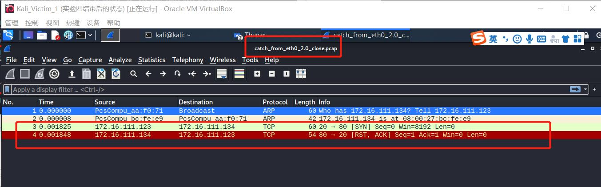
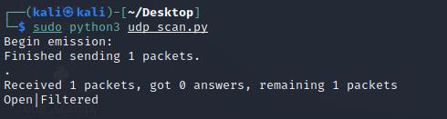

##  实验五：基于 Scapy 编写端口扫描器


### 实验目的

- 掌握网络扫描之端口状态探测的基本原理

### 实验环境

- python + [scapy](https://scapy.net/)

- 攻击者主机（Attacker）：Kali-Linux-2021.2

- 网关（Gateway）：Debian 10

- 靶机（Victim）：Kali-Linux-2021.2


### 实验要求(完成度)

- [x] 禁止探测互联网上的 IP ，严格遵守网络安全相关法律法规
- [x] 完成以下扫描技术的编程实现
  - TCP connect scan / TCP stealth scan
  - TCP Xmas scan / TCP fin scan / TCP null scan
  - UDP scan
- [x] 上述每种扫描技术的实现测试均需要测试端口状态为：`开放`、`关闭` 和 `过滤` 状态时的程序执行结果
- [x] 提供每一次扫描测试的抓包结果并分析与课本中的扫描方法原理是否相符？如果不同，试分析原因；
- [x] 在实验报告中详细说明实验网络环境拓扑、被测试 IP 的端口状态是如何模拟的
- [x] （可选）复刻 `nmap` 的上述扫描技术实现的命令行参数开关

------

### Scapy 基础

```python
# 导入模块
from scapy.all import *
# 查看包信息
pkt = IP(dst="")
ls(pkt)
pkt.show()
summary(pkt)
# 发送数据包
send(pkt)  # 发送第三层数据包，但不会受到返回的结果。
sr(pkt)  # 发送第三层数据包，返回两个结果，分别是接收到响应的数据包和未收到响应的数据包。
sr1(pkt)  # 发送第三层数据包，仅仅返回接收到响应的数据包。
sendp(pkt)  # 发送第二层数据包。
srp(pkt)  # 发送第二层数据包，并等待响应。
srp1(pkt)  # 发送第二层数据包，并返回响应的数据包
# 监听网卡
sniff(iface="wlan1",count=100,filter="tcp")
# 应用：简单的SYN端口扫描 （测试中）
pkt = IP("...")/TCP(dport=[n for n in range(22, 3389)], flags="S")
ans, uans = sr(pkt)
ans.summary() # flag为SA表示开放，RA表示关闭
```
------

### 实验原理

**参考链接：**

1. [B站授课视频](https://www.bilibili.com/video/BV1CL41147vX?p=49)
2. [在线课本](https://c4pr1c3.github.io/cuc-ns/chap0x05/main.html)

**复现一下要点：**

- TCP Connect扫描

| 序号 | 通信方向 | 流程 1      | 流程 2      | 流程 3                  |
| :--- | :------- | :---------- | :---------- | :---------------------- |
| 1    | C -> S   | SYN+Port(n) | SYN+Port(n) | SYN+Port(n)             |
| 2    | S -> C   | SYN/ACK     | RST         | 无响应/其他拒绝反馈报文 |
| 3    | C -> S   | ACK         |             |                         |
| 4    | C -> S   | RST         |             |                         |
|      | 状态推断 | 开放 ✅      | 关闭 ⛔      | 被过滤 ⚠️                |

- TCP stealth scan

| 序号 | 通信方向 | 流程 1      | 流程 2      | 流程 3                  |
| :--- | :------- | :---------- | :---------- | :---------------------- |
| 1    | C -> S   | SYN+Port(n) | SYN+Port(n) | SYN+Port(n)             |
| 2    | S -> C   | SYN/ACK     | RST         | 无响应/其他拒绝反馈报文 |
| 3    | C -> S   | RST         |             |                         |
|      | 状态推断 | 开放 ✅      | 关闭 ⛔      | 被过滤 ⚠️                |

`TCP connect scan` 与 `TCP stealth scan` 都是先发送一个S，然后等待回应。如果有回应且标识为R，说明目标端口处于关闭状态；如果有回应且标识为SA，说明目标端口处于开放状态。这时

`TCP connect scan`会回复一个RA，在完成三次握手的同时断开连接

`TCP stealth scan`只回复一个R，不完成三次握手，直接取消建立连接

- TCP Xmas scan

| 序号 | 通信方向 | 流程 1                            | 流程 2                            |
| :--- | :------- | :-------------------------------- | :-------------------------------- |
| 1    | C -> S   | TCP FIN(1),PUSH(1),URG(1)+Port(n) | TCP FIN(1),PUSH(1),URG(1)+Port(n) |
| 2    | S -> C   | RST                               | 无响应/其他拒绝反馈报文           |
|      | 状态推断 | 关闭 ⛔                            | 开放 ✅ / 关闭 ⛔ / 被过滤 ⚠️        |

- TCP fin scan

| 序号 | 通信方向 | 流程 1          | 流程 2                     |
| :--- | :------- | :-------------- | :------------------------- |
| 1    | C -> S   | TCP FIN+Port(n) | TCP FIN+Port(n)            |
| 2    | S -> C   | RST             | 无响应/其他拒绝反馈报文    |
|      | 状态推断 | 关闭 ⛔          | 开放 ✅ / 关闭 ⛔ / 被过滤 ⚠️ |

- TCP null scan

| 序号 | 通信方向 | 流程 1                            | 流程 2                            |
| :--- | :------- | :-------------------------------- | :-------------------------------- |
| 1    | C -> S   | TCP FIN(0),PUSH(0),URG(0)+Port(n) | TCP FIN(0),PUSH(0),URG(0)+Port(n) |
| 2    | S -> C   | RST                               | 无响应/其他拒绝反馈报文           |
|      | 状态推断 | 关闭 ⛔                            | 开放 ✅ / 关闭 ⛔ / 被过滤 ⚠️        |

`TCP Xmas scan`  `TCP fin scan`  `TCP null scan`这三种扫描方式都属于**隐蔽扫描**，它们的优点是隐蔽性比`TCP connect scan` 与 `TCP stealth scan`好，但都需要自己构造数据包，要求由超级用户或者授权用户访问专门的系统调用。

`TCP Xmas scan`要对TCP 报文头 FIN、URG 和 PUSH 标记进行设置，如果端口关闭则回复R，其他状态无响应

  `TCP fin scan`  ，fin包可以直接通过防火墙，所以端口开放和过滤都对fin包无影响，不会响应，但端口关闭会响应R

`TCP null scan`则是关闭TCP所有的报文头标记，所以也是只有关闭的端口会响应R，其他状态不响应

- UDP scan

| 序号 | 通信方向 | 流程 1               | 流程 2                     |
| :--- | :------- | :------------------- | :------------------------- |
| 1    | C -> S   | UDP+Port(n)          | UDP+Port(n)                |
| 2    | S -> C   | UDP+port(n) 响应数据 | 无响应/其他拒绝反馈报文    |
|      | 状态推断 | 开放 ✅               | 开放 ✅ / 关闭 ⛔ / 被过滤 ⚠️ |

`UDP` 是一个无链接的协议，当我们向目标主机的 UDP 端口发送数据,我们并不能收到一个开放端口的确认信息,或是关闭端口的错误信息。

可是，在大多数情况下，当向一个未开放的 UDP 端口发送数据时,其主机就会返回一个 ICMP 不可到达(ICMP_PORT_UNREACHABLE)的错误，因此大多数 UDP 端口扫描的方法就是向各个被扫描的 UDP 端口发送零字节的 UDP 数据包，如果收到一个 ICMP 不可到达的回应，那么则认为这个端口是关闭的,对于没有回应的端口则认为是开放的。

但是如果目标主机安装有防火墙或其它可以过滤数据包的软硬件,那我们发出 UDP 数据包后,将可能得不到任何回应,我们将会见到所有的被扫描端口都是开放的。

------

### 实验过程

#### 网络拓扑


**使用的拓扑图类似第四章实验的拓扑结构：Attacker作为扫描端，Victim作为被扫描的靶机。**

在实验四的基础上，我们得知，攻击机本身ping不通靶机，但是由于开了网关作为代理，攻击机就可以ping通靶机了。


#### 端口状态模拟

在**靶机**上安装`ufw`

```
sudo apt-get update 
sudo apt install ufw
```

- **关闭状态**：对应端口没有开启监听, 防火墙没有开启。
  
  ```bash
  ufw disable
  systemctl stop apache2 #关闭端口80
  systemctl stop dnsmasq #关闭端口53
  ```
  
  - `dnsmasq`
  
    ```
    sudo apt-get update 
    sudo apt-get install dnsmasq ##安装dnsmasq
    systemctl start dnsmasq #启动
    systemctl status dnsmasq #查看状态
    systemctl stop dnsmasq #关闭
    ```
- **开启状态**：对应端口开启监听: `apache2`基于TCP, 在80端口提供服务; `DNS`服务基于`UDP`,在53端口提供服务。防火墙处于关闭状态。
  
  ```bash
  systemctl start apache2 # port 80
  systemctl start dnsmasq # port 53
  ```
- **过滤状态**：对应端口开启监听, 防火墙开启。
  
  ```bash
  ufw enable && ufw deny 80/tcp
  ufw enable && ufw deny 53/udp
  ```

检查`nmap`：


初始状态：


#### TCP connect scan

[tcp_connect_scan——python文件](code/tcp_connect_scan.py)

- Closed(关闭状态)
  
  
  
  - 攻击机执行代码(要把`.py`文件拖到虚拟机：设备——共享粘贴板——双向；拖放——双向；安装增强功能)：

    
  
  - 靶机抓包（**要先开始抓包，再在攻击机执行代码，否则抓到的包是不全的**）：
  
    ```
    #抓包执行的命令
    sudo tcpdump -i eth0 -enp -w catch_from_eth0.pcap
    ```
  
    用`wireshark`打开抓到的包`catch_from_eth0.pcap`
  
    
  
  - `nmap`复刻：
  
    ```
    nmap -sT -p 80 172.16.111.134
    ```
  
    
  
- Open

  

  - 攻击机执行代码：

    

  - 靶机抓包(先开启抓包，再在攻击机执行代码)：

    

    用wireshark打开抓到的包：

    

  - `nmap`复刻：

    

- Filtered
  
  
  
  - 攻击机执行代码：
  
    
  
  - 靶机抓包(先开启抓包，再在攻击机执行代码)：
  
    
  
    用wireshark打开抓到的包：
  
    
  
  - `nmap`复刻：
  
    


#### TCP stealth scan

[tcp_stealth_scan—python文件](code/tcp_stealth_scan.py)

- Closed
  
  
  
  - 攻击机执行代码：

    
  
  - 靶机抓包(先开启抓包，再在攻击机执行代码)：
  
    
  
    用wireshark打开抓到的包：
  
    
  
  - `nmap`复刻：
  
    ```
    sudo nmap -sS -p 80 172.16.111.134
    ```
  
    
  
- Open

  在靶机执行`systemctl start apache2`

  - 攻击机执行代码(步骤和上面基本上完全一样，不展示图片了)

  - 靶机抓包(先开启抓包，再在攻击机执行代码)

    

  - `nmap`复刻：

    

- Filtered
  
  在靶机执行`sudo ufw enable && sudo ufw deny 80/tcp`
  
  - 攻击机执行代码
  
  - 靶机抓包(先开启抓包，再在攻击机执行代码)
  
    
  
  - `nmap`复刻：
  
    


#### TCP Xmas scan

[tcp_xmas_scan——python文件](code/tcp_xmas_scan.py)

- Closed
  
  
  
  - 攻击机执行代码：
  
    
  
  - 靶机抓包(先开启抓包，再在攻击机执行代码)
  
    
  
    用wireshark打开抓到的包：
  
    
  
  - `nmap`复刻：
  
    ```
    sudo nmap -sX -p 80 172.16.111.134
    ```
  
    
  
- Open|Filtered(Open状态和Filtered状态的实验过程，除了靶机最开始执行的命令不一样，其他所有结果【抓包过程和抓包结果】都相同，也和前面的实验原理匹配上了)

  `Open`状态靶机执行(默认前面完成的是closed部分了，防火墙已经是关闭状态了，只需要打开端口监听；如果防火墙没有关闭，还要执行`sudo ufw disable`)：
  
  
  
  `Filtered`状态靶机执行：`sudo ufw enable && sudo ufw deny 80/tcp`
  
  
  
  - 攻击机执行代码
  
    
  
  - 靶机抓包(先开启抓包，再在攻击机执行代码)
  
    
  
    用wireshark打开刚刚抓取到的包：
  
    
  
  - `nmap`复刻：
  
    


#### TCP fin scan

[tcp_fin_scan——python文件](code/tcp_fin_scan.py)


- Closed

  关掉靶机的端口监听和防火墙，和前面的closed状态一样，不重复展示截图了。

  - 攻击机执行代码：

    

  - 靶机抓包(先开启抓包，再在攻击机执行代码)

    

    用wireshark打开刚刚抓到的包：

    

  - `nmap`复刻：

    ```
    sudo nmap -sF -p 80 172.16.111.134
    ```

    

- Open|Filtered(Open状态和Filtered状态的实验过程，除了靶机最开始执行的命令不一样，其他所有结果【抓包过程和抓包结果】都相同，也和前面的实验原理匹配上了)

  `Open`状态,靶机执行(默认前面完成的是closed部分了，防火墙已经是关闭状态了，只需要打开端口监听；如果防火墙没有关闭，还要执行`sudo ufw disable`)：
  
  
  
  `Filtered`状态,靶机执行：`sudo ufw enable && sudo ufw deny 80/tcp`
  
  
  
  - 攻击机执行代码：
  
    
  
  - 靶机抓包(先开启抓包，再在攻击机执行代码)
  
    
  
  - `nmap`复刻：
  
    


#### TCP null scan

[tcp_null_scan——python文件](code/tcp_null_scan.py)

- Closed
  
  执行代码保证防火墙和端口监听都关闭。
  
  - 攻击机执行代码：
  
    
  
  - 靶机抓包(先开启抓包，再在攻击机执行代码)
  
    
  
    wireshark打开抓到的包：
  
    
  
  - `nmap`复刻：
  
    ```
    sudo nmap -sN -p 80 172.16.111.134
    ```
  
    
  
- Open|Filtered(Open状态和Filtered状态的实验过程，除了靶机最开始执行的命令不一样，其他所有结果【抓包过程和抓包结果】都相同，也和前面的实验原理匹配上了)

  `Open`状态,靶机执行(默认前面完成的是closed部分了，防火墙已经是关闭状态了，只需要打开端口监听；如果防火墙没有关闭，还要执行`sudo ufw disable`)：
  
  
  
  `Filtered`状态,靶机执行：`sudo ufw enable && sudo ufw deny 80/tcp`
  
  - 攻击机执行代码：
  
    
  
  - 靶机抓包(先开启抓包，再在攻击机执行代码)
  
    
  
    用wireshark打开抓到的包：
  
    
  
  - `nmap`复刻：
  
    

#### UDP scan

[udp_scan——python文件](code/udp_scan.py)


- Closed
  
  执行代码保证防火墙和端口监听都关闭。
  
  
  
  - 攻击机执行代码：
  
    
  
  - 靶机抓包(先开启抓包，再在攻击机执行代码)【前面一直用命令行抓包，也可以直接打开`wireshark`抓包】
  
    
  
    
  
  - `nmap`复刻：
  
    ```
    sudo nmap -sU -p 53 172.16.111.134
    ```
    
    
  
  
  
- Open

  执行`systemctl start dnsmasq`（端口开启监听【防火墙还是关闭状态】）
  
  - 攻击机执行代码：
  
    
  
  - 靶机抓包(先开启抓包，再在攻击机执行代码)
  
    
  
  - `nmap`复刻：
  
    
  
- Filtered

  

  - 攻击机执行代码：

    

  - 靶机抓包(先开启抓包，再在攻击机执行代码)

    

  - `nmap`复刻：

    


#### 其他实验问题的回答

- 提供每一次扫描测试的抓包结果并分析与课本中的扫描方法原理是否相符？如果不同，试分析原因。

  答：从上述实验过程可以看出：通过python编程实现的每一次扫描测试的抓包结果与课本中的扫描方法原理完全相符。

------

### 课后思考题：

- **通过本章网络扫描基本原理的学习，试推测应用程序版本信息的扫描原理，和网络漏洞的扫描原理。**

  **应用程序版本信息的扫描：**

  命令：`nmap –sV 172.16.111.134`

  

  **原理：**

  1. 首先检查open与open|filtered状态的端口是否在排除端口列表内。如果在排除列表，将该端口剔除。
  2. 如果是TCP端口，尝试建立TCP连接。尝试等待片刻（通常6秒或更多，具体时间可以查询文件nmap-services-probes中Probe TCP NULL q||对应的totalwaitms）。通常在等待时间内，会接收到目标机发送的“WelcomeBanner”信息。nmap将接收到的Banner与nmap-services-probes中NULL probe中的签名进行对比。查找对应应用程序的名字与版本信息。
  3. 如果通过“Welcome Banner”无法确定应用程序版本，那么nmap再尝试发送其他的探测包（即从nmap-services-probes中挑选合适的probe），将probe得到回复包与数据库中的签名进行对比。如果反复探测都无法得出具体应用，那么打印出应用返回报文，让用户自行进一步判定。
  4. 如果是UDP端口，那么直接使用nmap-services-probes中探测包进行探测匹配。根据结果对比分析出UDP应用服务类型。
  5. 如果探测到应用程序是SSL，那么调用openSSL进一步的侦查运行在SSL之上的具体的应用类型。
  6. 如果探测到应用程序是SunRPC，那么调用brute-force RPC grinder进一步探测具体服务。

  **网络漏洞的扫描**

  1. 第一阶段：发现目标主机或网络。
  2. 第二阶段：发现目标后进一步搜集目标信息，包括操作系统类型、运行的服务以及服务软件的版本等。如果目标是一个网络，还可以进一步发现该网络的拓扑结构、路由设备以及各主机的信息。
  3. 第三阶段：根据搜集到的信息判断或者进一步测试系统是否存在安全漏洞。

  网络安全漏洞扫描技术包括有 PING 扫射（Ping sweep）、操作系统探测 （Operating system identification）、如何探测访问控制规则 （firewalking）、端口扫描 （Port scan）以及漏洞扫描 （vulnerability scan）等。这些技术在网络安全漏洞扫描的三个阶段中各有体现。

  - PING 扫描用于网络安全漏洞扫描的第一阶段，可以帮助我们识别系统是否处于活动状态。
  - 操作系统探测、如何探测访问控制规则和端口扫描用于网络安全漏洞扫描的第二阶段，其中操作系统探测顾名思义就是对目标主机运行的操作系统进行识别；如何探测访问控制规则用于获取被防火墙保护的远端网络的资料；而端口扫描是通过与目标系统的 TCP/IP 端口连接，并查看该系统处于监听或运行状态的服务。
  - 网络安全漏洞扫描第三阶段采用的漏洞扫描通常是在端口扫描的基础上，对得到的信息进行相关处理，进而检测出目标系统存在的安全漏洞。

  参考：[网络安全漏洞扫描的工作原理](https://baijiahao.baidu.com/s?id=1597427790469983565&wfr=spider&for=pc)

- **网络扫描知识库的构建方法有哪些？**

  在扫描实践中总结知识库构建：在不同的实验环境中进行发包收包的实验，总结报文的发送和接收，TCP/IP协议栈的每一层的规律和规则，利用黑盒模糊测试思想。

- **除了 nmap 之外，目前还有哪些流行的网络扫描器？和 nmap 进行优缺点对比分析。**

  1. Zmap：Zmap采用了无状态的扫描技术，没有进行完整的TCP三次握手，因此扫描速度极大提升。Zmap的基本功能是扫描发现主机的开放端口。比nmap扫描速度快，但没有nmap扫描的准确，适合大范围扫描。
  2. Masscan：Masscan与Zmap类似，同样采用了无状态的扫描技术，扫描速度很快，但容易遗漏。
  3. nmap的优点：
     - 灵活：支持数十种不同的扫描方式，支持多种目标对象的扫描。
     - 强大：Nmap可以用于扫描互联网上大规模的计算机。
     - 可移植：支持主流操作系统：Windows/Linux/Unix/MacOS等等；源码开放，方便移植。
     - 简单：提供默认的操作能覆盖大部分功能。
     - 文档丰富：Nmap官网提供了详细的文档描述。Nmap作者及其他安全专家编写了多部Nmap参考书籍。
     - 流行。
     - 社区支持。

  Zmap和Masscan采用了无状态的扫描技术，扫描速度非常可观。在信息收集的初级阶段，可以使用Zmap或Masscan进行目标的情势了解，扫描单一端口的情况考虑使用Zmap，而多端口的情况下Masscan则更为快速。在做完初步了解之后，则应该使用功能更加丰富的Nmap进行进一步的详细扫描。

------

### 遇到的问题和解决办法：

1. 安装ufw时的报错：

   

   解决办法：执行`sudo apt install ufw`

2. 有些命令在执行的时候报错`You need to be root to run this script`，解决办法：使用`sudo`。

3. 完成TCP connect scan部分的实验之后要进行TCP stealth scan部分的实验：**下一部分实验的第一个状态是closed状态**，而靶机在完成TCP connect scan部分的实验之后的状态是过滤状态，即对应端口开启监听, 防火墙也开启；这时如果只执行`sudo ufw disable`，只是关闭了防火墙，没有关闭端口监听，(其实就是在open的状态而没有在closed状态)，攻击机执行程序的时候就会出现下图所示的情况：

   

   解决办法：执行`systemctl stop apache2` ，关闭端口80。

   
   
   总之，只要搞清楚：
   
   - closed状态：防火墙和监听端口都关闭
   - open状态：防火墙关闭，监听端口打开
   - filtered状态：防火墙和监听端口都打开
   
   根据所在的状态进行调整。

------

### 参考连接

- [scapy2.4.4文档](https://scapy.readthedocs.io/en/latest/)
- [B站授课视频](https://www.bilibili.com/video/BV1CL41147vX?p=49)
- [师哥的仓库](https://github.com/CUCCS/2020-ns-public-LyuLumos/tree/ch0x05/ch0x05)
- [Nmap扫描原理与用法](https://blog.csdn.net/aspirationflow/article/details/7694274)
- [Nmap、Zmap、Masscan](https://blog.51cto.com/xiaogongju/2068513)

